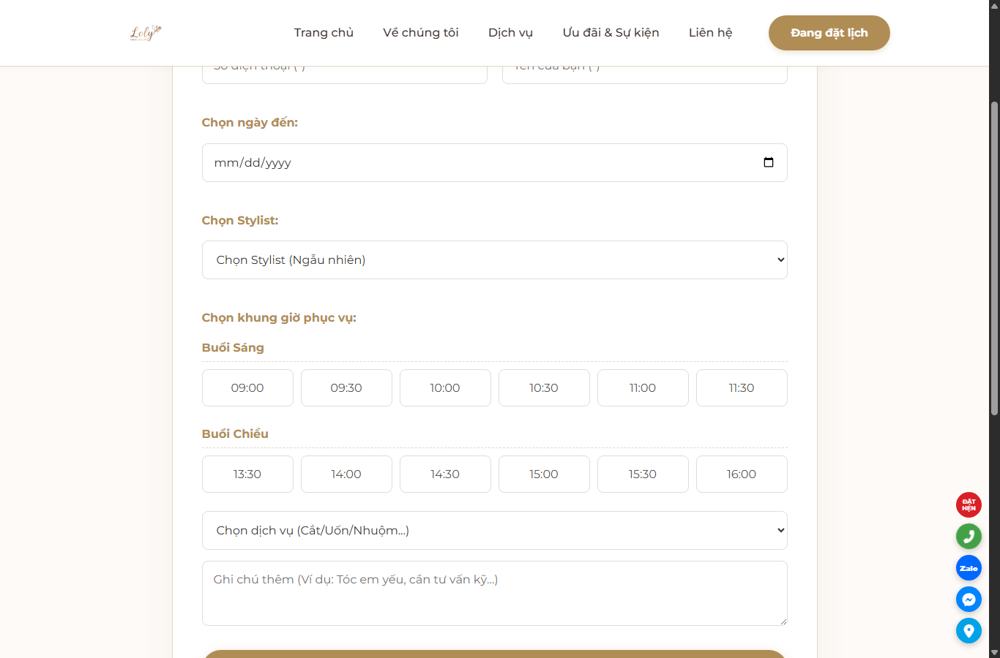
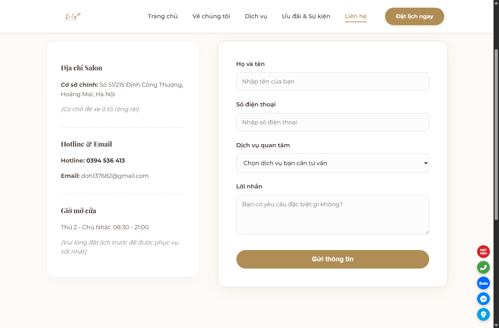
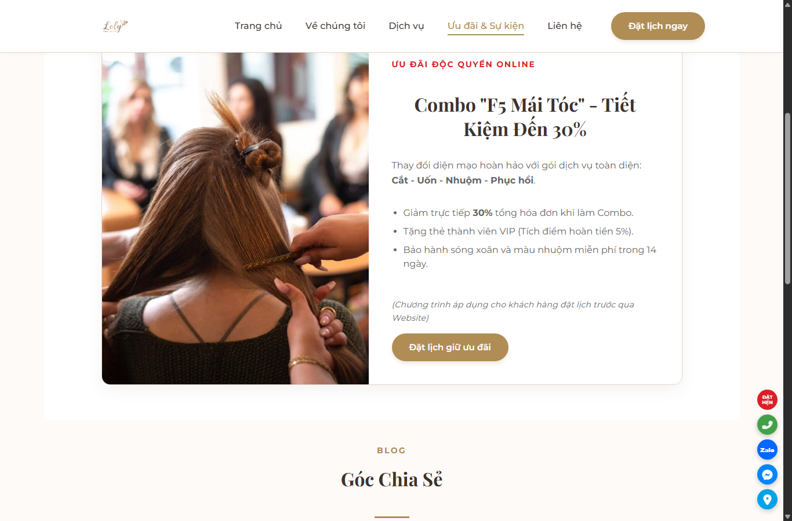
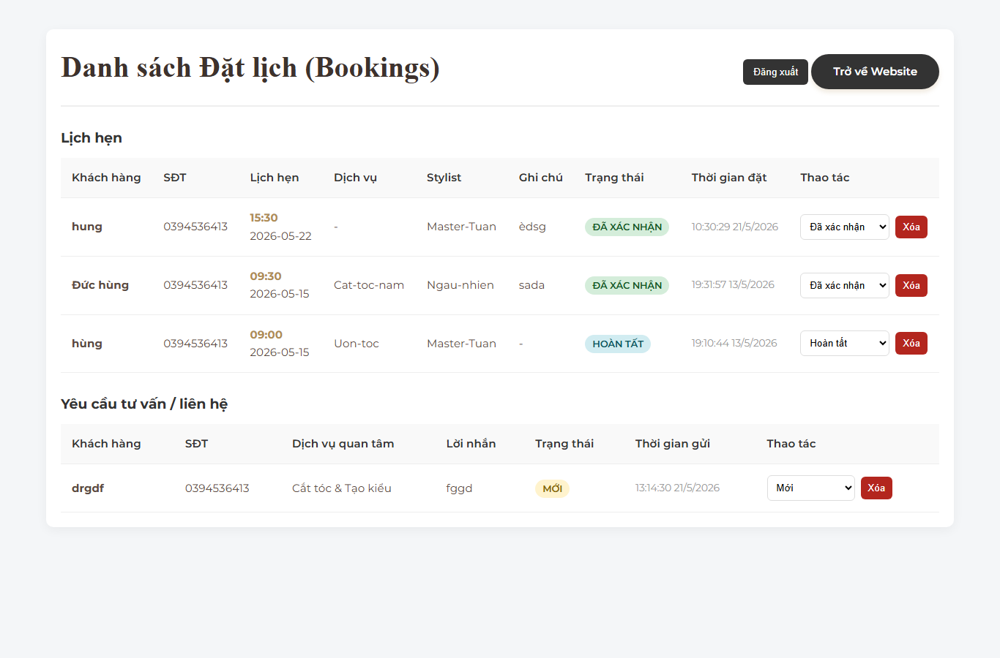

# Loly Hairsalon

Portfolio project mô phỏng website salon tóc, gồm giao diện khách hàng, đặt lịch online, form liên hệ, blog ưu đãi/sự kiện và trang quản trị nội bộ.

## Tính năng chính

### Giao diện responsive

Các trang chính được tối ưu để sử dụng trên mobile, tablet và desktop.


### Dịch vụ có bộ lọc

Trang dịch vụ hỗ trợ lọc theo danh mục, phân trang và sắp xếp theo giá bằng Vanilla JavaScript.


### Đặt lịch online

Form đặt lịch kiểm tra dữ liệu đầu vào, kiểm tra khung giờ trống và lưu lịch hẹn vào SQLite.



### Liên hệ và tư vấn

Form liên hệ/tư vấn được gom về backend chung thay vì gửi qua dịch vụ ngoài.



### Ưu đãi và sự kiện

Trang blog/ưu đãi hiển thị chương trình khuyến mãi và bài viết chăm sóc tóc từ API.



### Admin dashboard

Trang admin có đăng nhập, xem lịch hẹn, đổi trạng thái, xóa lịch hẹn và quản lý yêu cầu liên hệ.



## Công nghệ sử dụng

- Frontend: HTML5, CSS3, Vanilla JavaScript.
- Backend: Node.js 20 LTS, Express.
- Database: SQLite.
- API: quản lý lịch hẹn, liên hệ, bài viết và kiểm tra khung giờ trống.
- Security cơ bản: Helmet, cookie đăng nhập admin, rate limiting.

## Demo public

Website demo đang chạy trên Render:

[https://loly-hairsalon.onrender.com](https://loly-hairsalon.onrender.com)

Ghi chú: bản Render miễn phí phù hợp để làm demo portfolio, nhưng dữ liệu SQLite runtime có thể không bền vững như database production.

## Cấu trúc nổi bật

```text
.
|-- server.js          # Express API + static server
|-- main.js            # Logic giao diện, booking, contact, blog
|-- main.css           # Style chính
|-- admin.html         # Trang quản trị
|-- booking.html       # Trang đặt lịch
|-- contact.html       # Trang liên hệ
|-- blog.html          # Trang ưu đãi/sự kiện
|-- render.yaml        # Cấu hình deploy Render
|-- docs/screenshots/  # Ảnh minh họa trong README
|-- images/            # Hình ảnh giao diện
`-- data/              # SQLite runtime database, không đưa lên GitHub
```

# link demo:
Website chạy tại `http://localhost:3000/`, trang admin tại `http://localhost:3000/admin.html`.

Tk: admin
Mk: 123456
